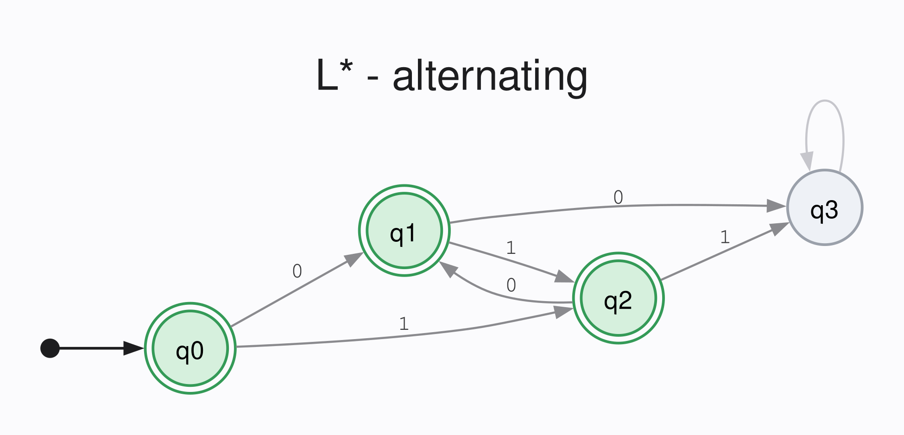
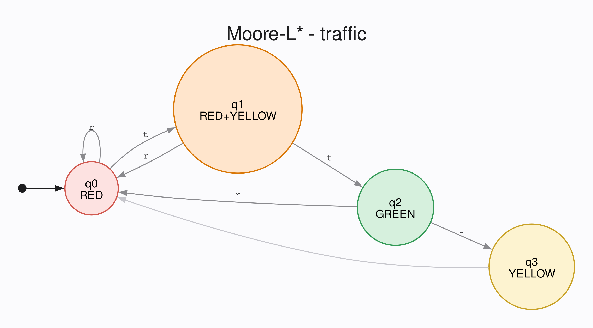

# Transmogrifier

A formally-verified extension to CompCert for compiling finite state automata.
Built atop [lstar-rocq](https://github.com/CharlesAverill/lstar-rocq).
[Performance tests](examples/perftests/) are provided.

Currently-supported automata:
- [x] DFAs
- [x] NFAs (Incomplete correctness proof)
- [x] Moore Machines
- [x] Mealy Machines

## Building

```bash
# Clone
git clone --recurse-submodules https://github.com/CharlesAverill/Transmogfrifier
cd Transmogrifier

# Install Dependencies
opam switch create rocq 4.14.3
opam repo add rocq-released https://rocq-prover.org/opam/released && opam update
opam pin add rocq-runtime 9.1.0
opam install . --deps-only

# Build
dune build
```

## Correctness

Verified against CompCert's Clight semantics in [`dfaproofs.v`](theories/transparency/dfaproofs.v):

- `compile_delta_correct` - `delta(q_i, s_i)` evaluates to the index of `δ(q, s)`
- `compile_delta_sink` - `delta` returns `|Q|` on out-of-range input
- `compile_accept_correct` - `accept(q_i)` returns `1` iff `q \in F`
- `compile_run_correct` - `run(w, |w|)` evaluates to the index of `δ*(q_0, w)`

## DFA Example

Consider the language of alternating bitstrings:

$$
\\{\\, w \in \\{0,1\\}^* \mid \forall i \in [1,|w|-1],\\; w_i \neq w_{i+1} \\,\\}.
$$

This language can be recognized by the following 4-state DFA:



[`alternating.ml`](examples/alternating.ml) initializes a teacher for this language, initiates the learning loop, and generates a C program containing a reference to the initial state, the transition function, the accept function, and a run function at [`alternating.c`](examples/alternating.c), along with a header file at [`alternating.h`](examples/alternating.h):

```c
unsigned long long delta(unsigned long long, unsigned long long);
_Bool accept(unsigned long long);
unsigned long long run(unsigned long long *, unsigned long long);
int $12(void);
unsigned long long const table[8] = { 2LL, 1LL, 1LL, 1LL, 1LL, 0LL, 2LL, 0LL,
  };

unsigned int const atable[4] = { 1, 0, 1, 1, };

unsigned long long delta(unsigned long long $6, unsigned long long $7)
{
  if ($6 < 4LLU & $7 < 2LLU) {
    return *(table + ($6 * 2LLU + $7));
  } else {
    return 4LLU;
  }
}

_Bool accept(unsigned long long $6)
{
  if ($6 < 4LLU) {
    return *(atable + $6);
  } else {
    return (_Bool) 0U;
  }
}

unsigned long long const q0 = 3LL;

unsigned long long run(unsigned long long *$8, unsigned long long $9)
{
  register unsigned long long $10;
  register unsigned long long $6;
  $10 = 0LLU;
  $6 = 3LLU;
  while (1) {
    if (! ($10 < $9)) {
      break;
    }
    $6 = delta($6, *($8 + $10));
    $10 = $10 + 1LLU;
  }
  return $6;
}

int $12(void)
{
  return 0;
}
```

```c
/* dfa.h -- interface to a DFA compiled to Clight by Transmogrifier.
 *
 * GENERATED from templates/dfa.h.in -- do not edit.
 * Machine: alternating
 */

#ifndef TRANSMOGRIFIER_DFA_H
#define TRANSMOGRIFIER_DFA_H

#ifdef __cplusplus
extern "C" {
#endif

typedef unsigned long long dfa_state_t;   /* 0..DFA_NSTATES-1, or DFA_SINK */
typedef unsigned long long dfa_symbol_t;  /* 0..DFA_NSYMS-1 */
typedef unsigned long long dfa_output_t;  /* 0..1; see the enum below */
typedef const dfa_symbol_t *dfa_word_t;

#define DFA_NSTATES 4ULL
#define DFA_NSYMS   2ULL
#define DFA_SINK    DFA_NSTATES

#define DFA_TABLE_LEN         (DFA_NSTATES * DFA_NSYMS)
#define DFA_TABLE_INDEX(q, a) ((q) * DFA_NSYMS + (a))

/* ---- Input symbols, in Sigma.enum order ---- */
typedef enum {
    SYM_0 = 0ULL, /* "0" */
    SYM_1 = 1ULL, /* "1" */
    SYM_COUNT = 2ULL /* |Sigma|; delta's out-of-range threshold */
} dfa_input_sym_t;

/* ---- The bool output alphabet ----
 *
 * accept returns an index into O.enum, and for a DFA that enum is
 *
 *     Definition enum := [true; false].      (* theories/compiler/dfa.v *)
 *
 * so accepting is 0 and rejecting is 1. This inverts the C convention:
 * `if (accept(q))` is BACKWARDS. Use DFA_IS_ACCEPTING or the wrappers below.
 */
typedef enum {
    DFA_TRUE = 0ULL, /* "true" */
    DFA_FALSE = 1ULL, /* "false" */
    DFA_COUNT = 2ULL /* |O|; accept_entry's out-of-range fallback */
} dfa_bool;

#define DFA_ACCEPT_INDEX 0ULL
#define DFA_REJECT_INDEX 1ULL
#define DFA_IS_ACCEPTING(o) ((o) == DFA_ACCEPT_INDEX)

/* ---- Emitted globals (read-only) ---- */
extern const dfa_state_t  table[DFA_TABLE_LEN];
extern const dfa_output_t atable[DFA_NSTATES];
extern const dfa_state_t  q0;

/* ---- Functions ---- */
extern dfa_state_t  delta(dfa_state_t q, dfa_symbol_t a);
extern dfa_output_t accept(dfa_state_t q);
extern dfa_state_t  run(dfa_word_t w, unsigned long long len);

/** Whether q is accepting. Only q < DFA_NSTATES is proved
 *  (compile_accept_correct assumes a valid state index). */
static inline int dfa_state_accepts(dfa_state_t q)
{
    return DFA_IS_ACCEPTING(accept(q));
}

/** Whether the DFA accepts w. This is the composition the correctness theorems
 *  are about: compile_run_correct lands on the right state, and
 *  compile_accept_correct reports its output. */
static inline int dfa_accepts(dfa_word_t w, unsigned long long len)
{
    return dfa_state_accepts(run(w, len));
}

#ifdef __cplusplus
}
#endif

#endif /* TRANSMOGRIFIER_DFA_H */
```

Compiling with CompCert, we get the following machine code:

```
$ ccomp -c -O3 examples/alternating.c
$ objdump -d alternating.o 

alternating.o:     file format elf64-x86-64


Disassembly of section .text:

0000000000000000 <delta>:
   0:   48 83 ec 08             sub    $0x8,%rsp
   4:   48 8d 44 24 10          lea    0x10(%rsp),%rax
   9:   48 89 04 24             mov    %rax,(%rsp)
   d:   48 83 ff 04             cmp    $0x4,%rdi
  11:   0f 92 c2                setb   %dl
  14:   0f b6 d2                movzbl %dl,%edx
  17:   48 83 fe 02             cmp    $0x2,%rsi
  1b:   41 0f 92 c0             setb   %r8b
  1f:   45 0f b6 c0             movzbl %r8b,%r8d
  23:   44 21 c2                and    %r8d,%edx
  26:   83 fa 00                cmp    $0x0,%edx
  29:   74 11                   je     3c <delta+0x3c>
  2b:   4c 8d 05 00 00 00 00    lea    0x0(%rip),%r8        # 32 <delta+0x32>
  32:   48 8d 0c 7e             lea    (%rsi,%rdi,2),%rcx
  36:   49 8b 04 c8             mov    (%r8,%rcx,8),%rax
  3a:   eb 05                   jmp    41 <delta+0x41>
  3c:   b8 04 00 00 00          mov    $0x4,%eax
  41:   48 83 c4 08             add    $0x8,%rsp
  45:   c3                      ret
  46:   66 2e 0f 1f 84 00 00    cs nopw 0x0(%rax,%rax,1)
  4d:   00 00 00 

0000000000000050 <accept>:
  50:   48 83 ec 08             sub    $0x8,%rsp
  54:   48 8d 44 24 10          lea    0x10(%rsp),%rax
  59:   48 89 04 24             mov    %rax,(%rsp)
  5d:   48 83 ff 04             cmp    $0x4,%rdi
  61:   73 15                   jae    78 <accept+0x28>
  63:   48 8d 05 00 00 00 00    lea    0x0(%rip),%rax        # 6a <accept+0x1a>
  6a:   8b 04 b8                mov    (%rax,%rdi,4),%eax
  6d:   83 f8 00                cmp    $0x0,%eax
  70:   0f 95 c0                setne  %al
  73:   0f b6 c0                movzbl %al,%eax
  76:   eb 02                   jmp    7a <accept+0x2a>
  78:   31 c0                   xor    %eax,%eax
  7a:   48 83 c4 08             add    $0x8,%rsp
  7e:   c3                      ret
  7f:   90                      nop

0000000000000080 <run>:
  80:   48 83 ec 28             sub    $0x28,%rsp
  84:   48 8d 44 24 30          lea    0x30(%rsp),%rax
  89:   48 89 04 24             mov    %rax,(%rsp)
  8d:   48 89 5c 24 08          mov    %rbx,0x8(%rsp)
  92:   48 89 6c 24 10          mov    %rbp,0x10(%rsp)
  97:   4c 89 64 24 18          mov    %r12,0x18(%rsp)
  9c:   48 89 f3                mov    %rsi,%rbx
  9f:   48 89 fd                mov    %rdi,%rbp
  a2:   4d 31 e4                xor    %r12,%r12
  a5:   bf 03 00 00 00          mov    $0x3,%edi
  aa:   49 39 dc                cmp    %rbx,%r12
  ad:   73 14                   jae    c3 <run+0x43>
  af:   4a 8b 74 e5 00          mov    0x0(%rbp,%r12,8),%rsi
  b4:   e8 00 00 00 00          call   b9 <run+0x39>
  b9:   48 89 c7                mov    %rax,%rdi
  bc:   4d 8d 64 24 01          lea    0x1(%r12),%r12
  c1:   eb e7                   jmp    aa <run+0x2a>
  c3:   48 89 f8                mov    %rdi,%rax
  c6:   48 8b 5c 24 08          mov    0x8(%rsp),%rbx
  cb:   48 8b 6c 24 10          mov    0x10(%rsp),%rbp
  d0:   4c 8b 64 24 18          mov    0x18(%rsp),%r12
  d5:   48 83 c4 28             add    $0x28,%rsp
  d9:   c3                      ret
  da:   66 0f 1f 44 00 00       nopw   0x0(%rax,%rax,1)

00000000000000e0 <$12>:
  e0:   48 83 ec 08             sub    $0x8,%rsp
  e4:   48 8d 44 24 10          lea    0x10(%rsp),%rax
  e9:   48 89 04 24             mov    %rax,(%rsp)
  ed:   31 c0                   xor    %eax,%eax
  ef:   48 83 c4 08             add    $0x8,%rsp
  f3:   c3                      ret
```

## Moore Machine Example

Consider a four-phase traffic light that cycles between

```
Red -> Red+Yellow -> Green -> Yellow -> Red -> ...
```

This system can be encoded as a 4-state Moore Machine with tick `t` and reset `r` signals:



[`traffic.ml`](examples/traffic.ml) initializes a teacher for this system, initiates the learning loop, and generates a C program containing a reference to the initial state, the transition function, the output function, and a run function at [`traffic.c`](examples/traffic.c), along with a header file at [`traffic.h`](examples/traffic.h):

```c
unsigned long long delta(unsigned long long, unsigned long long);
unsigned long long output(unsigned long long);
unsigned long long run(unsigned long long *, unsigned long long);
int $12(void);
unsigned long long const table[8] = { 3LL, 3LL, 0LL, 3LL, 1LL, 3LL, 2LL, 3LL,
  };

unsigned long long const atable[4] = { 2LL, 1LL, 3LL, 0LL, };

unsigned long long delta(unsigned long long $6, unsigned long long $7)
{
  if ($6 < 4LLU & $7 < 2LLU) {
    return *(table + ($6 * 2LLU + $7));
  } else {
    return 4LLU;
  }
}

unsigned long long output(unsigned long long $6)
{
  if ($6 < 4LLU) {
    return *(atable + $6);
  } else {
    return (_Bool) 0U;
  }
}

unsigned long long const q0 = 3LL;

unsigned long long run(unsigned long long *$8, unsigned long long $9)
{
  register unsigned long long $10;
  register unsigned long long $6;
  $10 = 0LLU;
  $6 = 3LLU;
  while (1) {
    if (! ($10 < $9)) {
      break;
    }
    $6 = delta($6, *($8 + $10));
    $10 = $10 + 1LLU;
  }
  return $6;
}

int $12(void)
{
  return 0;
}
```

```c
/* moore.h -- interface to a Moore machine compiled to Clight by Transmogrifier.
 *
 * GENERATED from templates/moore.h.in -- do not edit.
 * Machine: traffic
 */

#ifndef TRANSMOGRIFIER_MOORE_H
#define TRANSMOGRIFIER_MOORE_H

#ifdef __cplusplus
extern "C" {
#endif

typedef unsigned long long moore_state_t;  /* 0..MOORE_NSTATES-1, or the sink */
typedef unsigned long long moore_symbol_t; /* 0..MOORE_NSYMS-1 */
typedef unsigned long long moore_output_t; /* 0..MOORE_NOUTS-1 */
typedef const moore_symbol_t *moore_word_t;

#define MOORE_NSTATES 4ULL
#define MOORE_NSYMS   2ULL
#define MOORE_NOUTS   4ULL

/** Returned by delta when either index is out of range. */
#define MOORE_SINK    MOORE_NSTATES

/** Flat size of the transition table, in elements. */
#define MOORE_TABLE_LEN         (MOORE_NSTATES * MOORE_NSYMS)
/** Row-major index of (q, a) within the transition table. */
#define MOORE_TABLE_INDEX(q, a) ((q) * MOORE_NSYMS + (a))

/* ---- Input symbols, in Sigma.enum order ---- */
typedef enum {
    SYM_T = 0ULL, /* "t" */
    SYM_R = 1ULL, /* "r" */
    SYM_COUNT = 2ULL /* |Sigma|; delta's out-of-range threshold */
} input_sym_t;

/* ---- Output symbols, in O.enum order ---- */
typedef enum {
    OUT_RED = 0ULL, /* "RED" */
    OUT_GREEN = 1ULL, /* "GREEN" */
    OUT_YELLOW = 2ULL, /* "YELLOW" */
    OUT_RED_YELLOW = 3ULL, /* "RED+YELLOW" */
    OUT_COUNT = 4ULL /* |O|; accept_entry's out-of-range fallback */
} output_sym_t;

/* ---- Emitted globals (read-only) ---- */

/** table[q * MOORE_NSYMS + a] == delta(q, a). */
extern const moore_state_t table[MOORE_TABLE_LEN];
/** atable[q] == index of lambda(q) in O.enum. */
extern const moore_output_t atable[MOORE_NSTATES];
/** Index of the initial state. */
extern const moore_state_t q0;

/* ---- Functions ---- */

/**
 * Transition: delta(q, a).
 * In range (q < MOORE_NSTATES, a < MOORE_NSYMS): the successor's index.
 * Out of range: MOORE_SINK.
 * Verified: compile_delta_correct, compile_delta_sink.
 */
extern moore_state_t delta(moore_state_t q, moore_symbol_t a);

/**
 * Output: lambda(q). Returns the index of q's output symbol.
 */
extern moore_output_t output(moore_state_t q);

/**
 * Run from q0 over w. Equivalent to folding delta over w.
 * Verified: compile_run_correct.
 */
extern moore_state_t run(moore_word_t w, unsigned long long len);

/** The output produced by running w from q0. Not emitted -- the obvious
 *  composition, provided for convenience. */
static inline moore_output_t moore_run_output(moore_word_t w,
                                              unsigned long long len)
{
    return output(run(w, len));
}

#ifdef __cplusplus
}
#endif

#endif /* TRANSMOGRIFIER_MOORE_H */
```

Compiling with CompCert, we get the following machine code:

```
$ ccomp -c -O3 examples/traffic.c
$ objdump -d traffic.o 

traffic.o:     file format elf64-x86-64


Disassembly of section .text:

0000000000000000 <delta>:
   0:   48 83 ec 08             sub    $0x8,%rsp
   4:   48 8d 44 24 10          lea    0x10(%rsp),%rax
   9:   48 89 04 24             mov    %rax,(%rsp)
   d:   48 83 ff 04             cmp    $0x4,%rdi
  11:   0f 92 c2                setb   %dl
  14:   0f b6 d2                movzbl %dl,%edx
  17:   48 83 fe 02             cmp    $0x2,%rsi
  1b:   41 0f 92 c0             setb   %r8b
  1f:   45 0f b6 c0             movzbl %r8b,%r8d
  23:   44 21 c2                and    %r8d,%edx
  26:   83 fa 00                cmp    $0x0,%edx
  29:   74 11                   je     3c <delta+0x3c>
  2b:   4c 8d 05 00 00 00 00    lea    0x0(%rip),%r8        # 32 <delta+0x32>
  32:   48 8d 0c 7e             lea    (%rsi,%rdi,2),%rcx
  36:   49 8b 04 c8             mov    (%r8,%rcx,8),%rax
  3a:   eb 05                   jmp    41 <delta+0x41>
  3c:   b8 04 00 00 00          mov    $0x4,%eax
  41:   48 83 c4 08             add    $0x8,%rsp
  45:   c3                      ret
  46:   66 2e 0f 1f 84 00 00    cs nopw 0x0(%rax,%rax,1)
  4d:   00 00 00 

0000000000000050 <output>:
  50:   48 83 ec 08             sub    $0x8,%rsp
  54:   48 8d 44 24 10          lea    0x10(%rsp),%rax
  59:   48 89 04 24             mov    %rax,(%rsp)
  5d:   48 83 ff 04             cmp    $0x4,%rdi
  61:   73 0d                   jae    70 <output+0x20>
  63:   48 8d 05 00 00 00 00    lea    0x0(%rip),%rax        # 6a <output+0x1a>
  6a:   48 8b 04 f8             mov    (%rax,%rdi,8),%rax
  6e:   eb 03                   jmp    73 <output+0x23>
  70:   48 31 c0                xor    %rax,%rax
  73:   48 83 c4 08             add    $0x8,%rsp
  77:   c3                      ret
  78:   0f 1f 84 00 00 00 00    nopl   0x0(%rax,%rax,1)
  7f:   00 

0000000000000080 <run>:
  80:   48 83 ec 28             sub    $0x28,%rsp
  84:   48 8d 44 24 30          lea    0x30(%rsp),%rax
  89:   48 89 04 24             mov    %rax,(%rsp)
  8d:   48 89 5c 24 08          mov    %rbx,0x8(%rsp)
  92:   48 89 6c 24 10          mov    %rbp,0x10(%rsp)
  97:   4c 89 64 24 18          mov    %r12,0x18(%rsp)
  9c:   48 89 f3                mov    %rsi,%rbx
  9f:   48 89 fd                mov    %rdi,%rbp
  a2:   4d 31 e4                xor    %r12,%r12
  a5:   bf 03 00 00 00          mov    $0x3,%edi
  aa:   49 39 dc                cmp    %rbx,%r12
  ad:   73 14                   jae    c3 <run+0x43>
  af:   4a 8b 74 e5 00          mov    0x0(%rbp,%r12,8),%rsi
  b4:   e8 00 00 00 00          call   b9 <run+0x39>
  b9:   48 89 c7                mov    %rax,%rdi
  bc:   4d 8d 64 24 01          lea    0x1(%r12),%r12
  c1:   eb e7                   jmp    aa <run+0x2a>
  c3:   48 89 f8                mov    %rdi,%rax
  c6:   48 8b 5c 24 08          mov    0x8(%rsp),%rbx
  cb:   48 8b 6c 24 10          mov    0x10(%rsp),%rbp
  d0:   4c 8b 64 24 18          mov    0x18(%rsp),%r12
  d5:   48 83 c4 28             add    $0x28,%rsp
  d9:   c3                      ret
  da:   66 0f 1f 44 00 00       nopw   0x0(%rax,%rax,1)

00000000000000e0 <$12>:
  e0:   48 83 ec 08             sub    $0x8,%rsp
  e4:   48 8d 44 24 10          lea    0x10(%rsp),%rax
  e9:   48 89 04 24             mov    %rax,(%rsp)
  ed:   31 c0                   xor    %eax,%eax
  ef:   48 83 c4 08             add    $0x8,%rsp
  f3:   c3                      ret
```
